# ROCK-PAPER-SCISSORS THE GAME
Exercising good coding practices by creating a rock, paper, scissors game.

## REQUIREMENTS
**MUST**
- [ ] Must have testing set up for Vanilla JS.
- [ ] Must have a landing page.
- [ ] Must have a lobby that shows who's available to play against.
- [ ] Must consolidate code in a clean and organized way.
- [ ] Must have single and multiplayer options.
- [ ] Must show player names', scores', and game choices before processing a round.

**SHOULD**
- [ ] Should have a total of 8 players able to join at one time.
- [ ] Should allow people to create their own profile.
- [ ] Should have a lobby for players to request a game with other players.
- [ ] Should have dynamically created pages for single and multiplayers. (_Although I could cheat by making a set number of html pages._)
- [ ] Should store user information and progress using cookies temporarily for up to a month. 
- [ ] Should have predetermined CSS classes and only create elements via Javascript that adhere to those classes for styling.

**COULD**
- [ ] Could have backend written in typescript.
- [ ] Could have the documented UX workflow for the website.
- [ ] Could use coding patterns for the majority of the code.
- [ ] Could make use of sockets for real time interaction.
- [ ] Could be refactored into a create-react-app.

**WILL NOT**
- [ ] Will not have a database.
- [ ] Will not have an authentication system.
- [ ] Will not permanently store user information as this is a proof of concept.

## APPLICATION UX FLOW
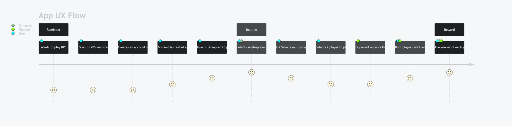
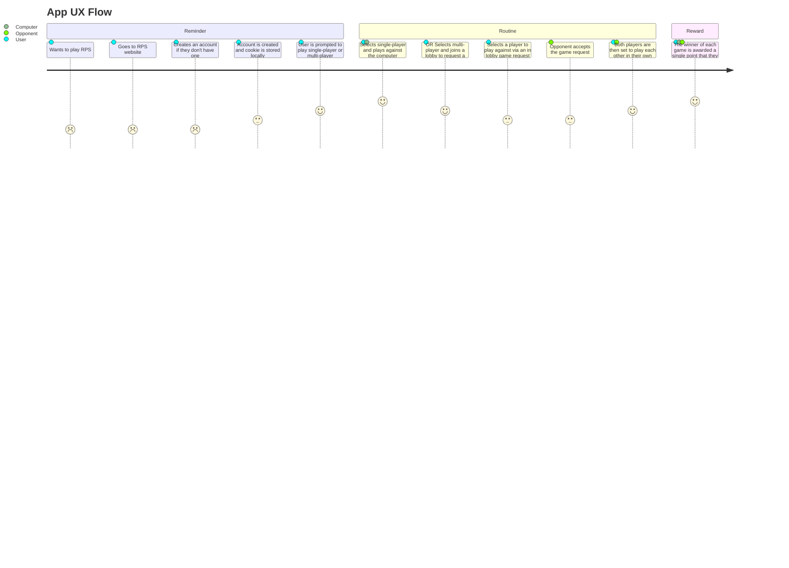

## CLASS DIAGRAMS
### PLAYER CLASS DIAGRAM
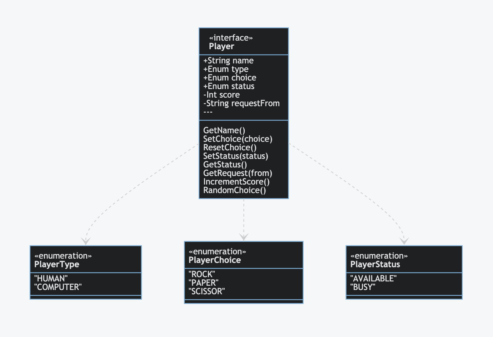
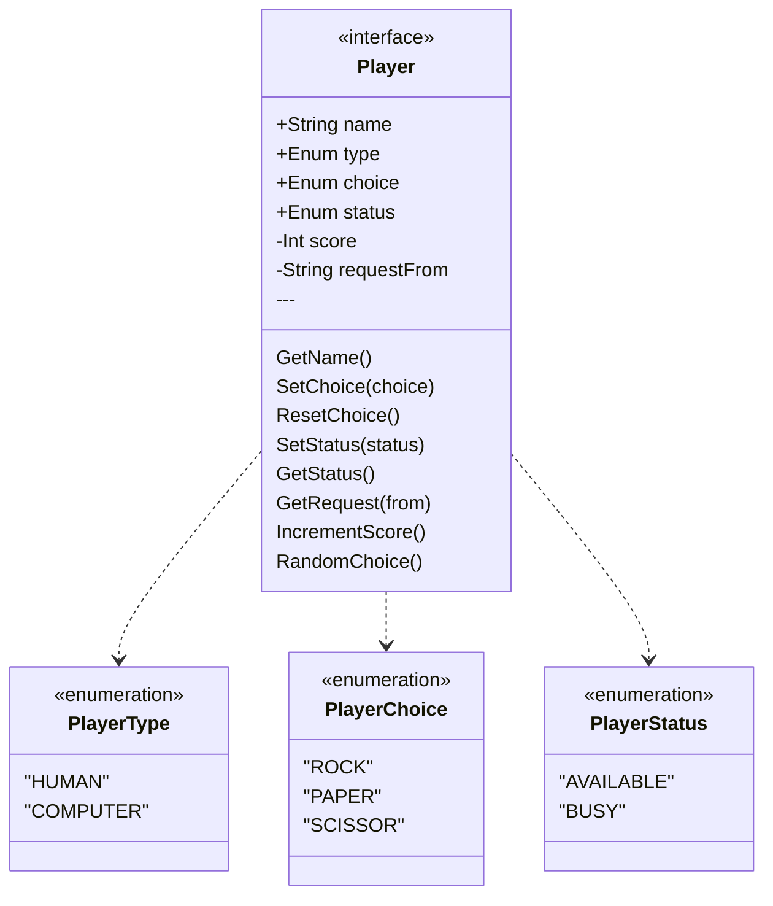

### LOBBY CLASS DIAGRAM
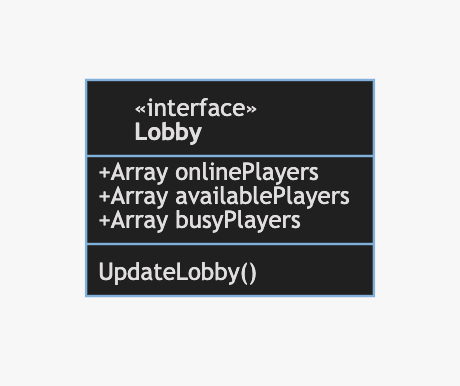
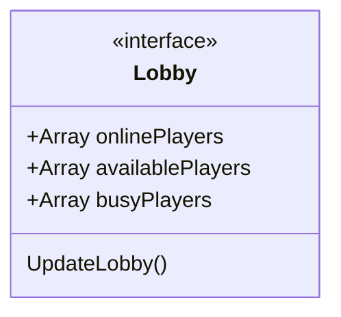

### REQUEST CLASS DIAGRAM
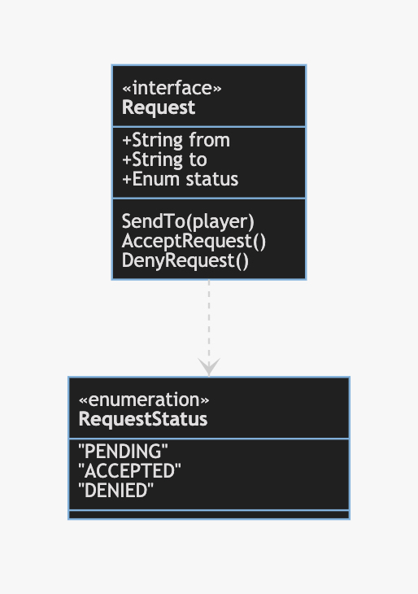
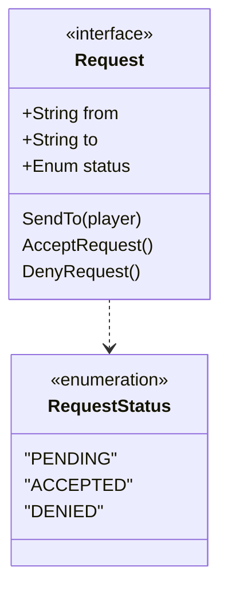

### GAME CLASS DIAGRAM
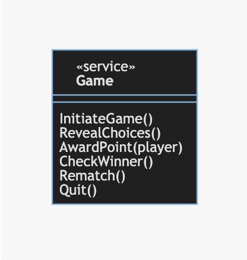
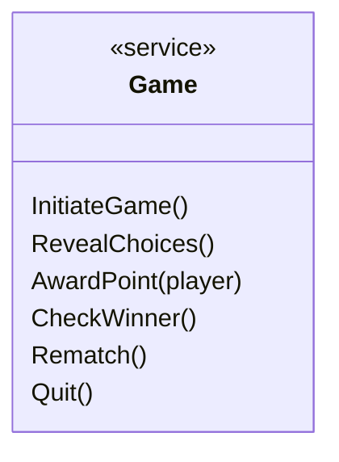

### USER INTERFACE CLASS DIAGRAM
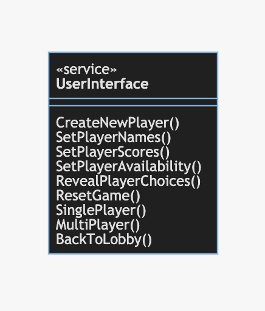
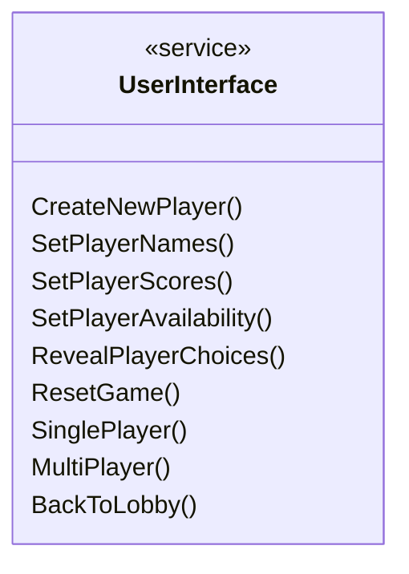